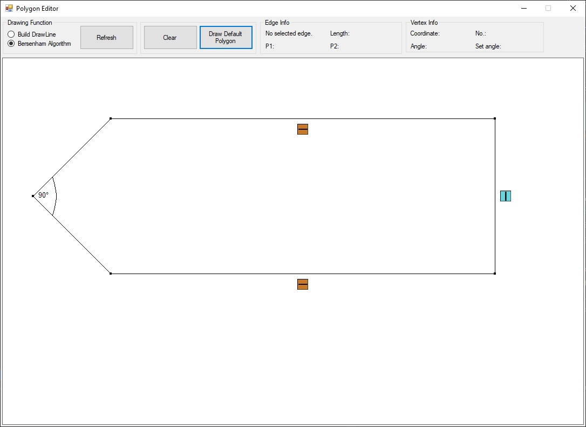

# PolygonEditor
_Aplikacja stworzona w ramach przedmiotu **Grafika Komputerowa 1**, realizowanego na wydziale **MINI PW**._

## Klawiszologia:

Jeśli obszar roboczy jest pusty, to rysowanie odbywa się poprzez klikanie myszką na planszę w celu dodania kolejnych wierzchołków do wielokąta. Rysowanie jest kończone, kiedy znajdują się conajmniej trzy
wierzchołki oraz został kliknięty pierwszy dodany wierzchołek (przez co wielokąt się zamyka).

**Przesuwanie wierzchołka** — kliknięcie i przytrzymanie lewego klawisza myszy i przesuwanie nim.
Puszczenie przycisku zatwierdza położenie wierzchołka.

W lewym górnym rogu znajdują się opcje wyboru rysowania linii.
W prawym górnym rogu wyświetlane są informacje o zaznaczonym wierzchołku/krawędzi.

  * Przycisk Refresh- odświeża malowanie wielokąta, przez co zmiany
wyboru rysowania linii będą widoczne. Przemalowuje obszar na nowo.
  * Przycisk Clear- Czyści obszar do malowania wielokątu.
  * Przycisk Draw Default- rysuje predefiniowany wielokąt z ograniczeniami.

Prawy przycisk myszy na wierzchołku wyświetla dostępne opcje (oraz podświetla wierzchołek):
  * Usuwanie wierzchołka
  * Ustawienie kąt w wierzchołku (jeśli kąt jest ustawiony, to opcja jest zaznaczona. Kliknięcie
zaznaczonej opcji powoduje usunięcie ograniczenia).

Opcje są dostępne, o ile są zachowane relacje m.in. dla usuwnia wierchołków to więcej niż 3 wierzchołki.

Prawy przycisk myszy na krawędzi wyświetli dostępne opcje, o ile
pozwalają na to relacje (będą szare):
- Ustawienie krawędzi pionowej
- Ustawienie krawędzi poziomej
- Dodanie wierzchołka w krawędzi
Dla ograniczeń: jeśli krawędź ma ograniczenie, to klikając prawy przycisk myszy, widać zaznaczenie przy
ograniczeniu. Kliknięcie zaznaczonego ograniczenia usuwa ograniczenie.

## Algorytm
Przedstawiony przeze mnie wielokąt to zbiór kolejnych punktów, w których przechowywana
jest informacja na temat, jakie ograniczenie ma krawędź następna i poprzednia.

Wierzchołek na potrzeby kątów
ma informacje czy jest przy tym wierzchołku ograniczenie oraz współczynniki kierunkowe
prostych tworzących ten kąt (czyli współczynnik prostej przechodzącej przez poprzedni punkt i ten punkt gdzie
jest zadany kąt oraz prostej przechodzącej przez ten punkt i następny)
Miara kąta dla ułatwienia jest całkowita. Jeśli podany kąt różni się od tego, który był pierwotnie, to następuje
wyliczenie nowego.
Wyliczenie nowego kąt polega na znalezieniu prostych przecinających
krawędź (która jest częścią kąta) pod zadanym kątem. Znalezione zostaną dwie proste, następnie obliczane są punkty przecięcia
tej prostej z prostą, na której leżał punkt przed zmiana kąta (czyli ten kąt po wyświetleniu)
Wybór punktu zależy od tego, czy punkt tworzy zadany kąt.
Sam kąt obliczany jest z ilorazu wektorowego, żeby ustalić, czy kąt jest powyżej 180, wyznaczam otoczkę wypukłą
punktów wielokąta.te punkty, które należą do otoczki, mają mniej niż 180 stopni.

Ustawienie ograniczenie poziomego i pionowego polega na dopasowaniu odpowiednich współrzędnych.

Poprawianie wielokąta następuje od punktu, który został zmieniony (od poruszonego).
Poprawianie następuje z dwóch stron, czyli idziemy po liście punktów w przód i w tył. Jako że wierzchołek zawiera informacje o swoim następniku i poprzedniku, następuje poprawa
w zależności od tego, na jaki rodzaj krawędzi poprawiamy.
Poprawianie kończy się, jeśli osiągniemy niczym nieograniczoną krawędź, jeśli stanęliśmy już na poprawionym elemencie, lub
wchodzimy do kąta. Jeśli poprawiane,
Jeśli poprawiamy ramie kąta to w oparciu o współczynnik kierunkowy prostej prostych tworzący dany kąt.